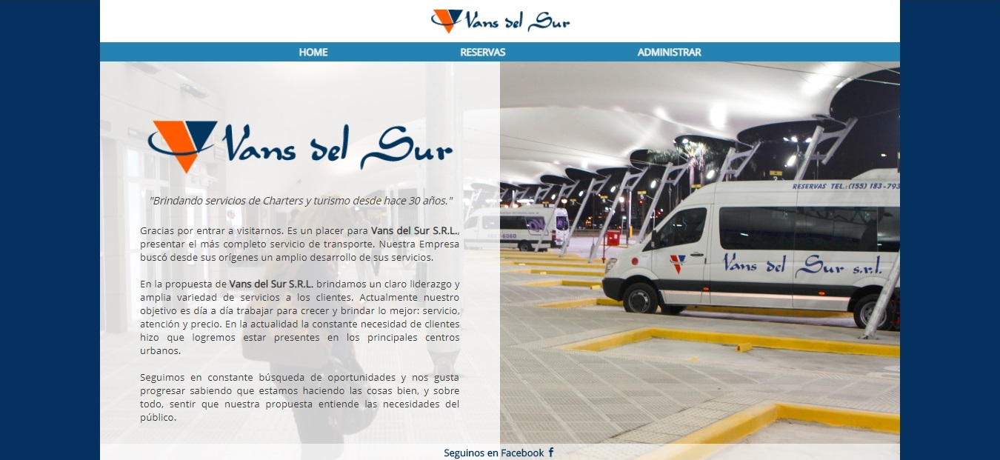

# Proyecto Final Comunidad It - En construcción -

Creado con HTML, CSS, Javascript + Firebase database.

## [Click acá para acceder al sitio](https://stoic-brahmagupta-12513c.netlify.com) ##

### Esta totalmente "en construcción".

Por favor,
**__por el momento no prestes mucha atención a la legibilidad y órden del código__**,
sobre todo en los .css Mi prioridad es la funcionalidad,
más adelante voy a ordenarlo y hacerlo mas legible.

## Mejoras a realizar:

- Momentaneamente uso Jquery __sólo para el efecto del Menú__, pero debo cambiarlo por un onclick+transition.

- Debo mejorar el responsive.

- Se deben mostrar los asientos ocupados.

- Agregarle un login para los conductores y que **solo ellos** accedan a la administración donde se muestre la lista de pasajeros por horario.

- Usando Node.js + Express hacer un CRUD para gestionar la base de datos. (Quizás reemplazando firebase database y usando solo la función de login.
